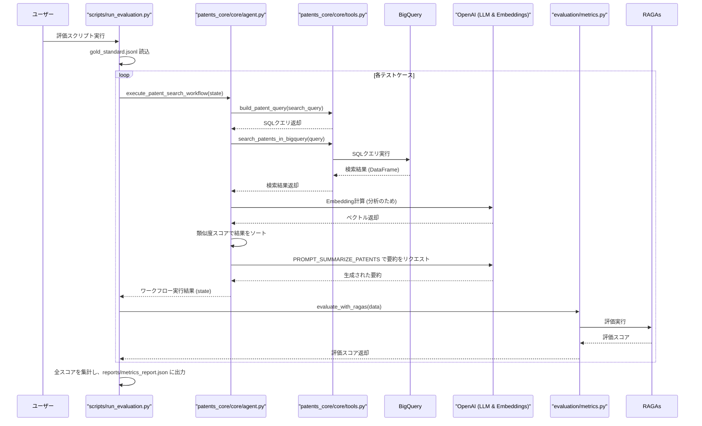

# PatentsFinder 3.0 アーキテクチャ解説：評価データからの処理フロー

このドキュメントは、特許検索アプリケーション「PatentsFinder 3.0」の評価システムが、どのように動作するかを解説します。
起点となる評価データ（`gold_standard.jsonl`）から、最終的な評価レポートが出力されるまでの一連の処理を、ステップバイステップで追跡します。

## 1. 起点となるデータ (`gold_standard.jsonl`)

評価プロセスは、以下のような構造を持つJSONLファイル（`evaluation/gold_standard.jsonl`）から始まります。各行が1つの評価テストケースです。

```json
{
  "query_id": "water_filtration_membrane_002",
  "question": "水ろ過膜技術に関する特許を検索してください。特に逆浸透膜に焦点を当ててください。",
  "search_query": {
    "ipc_codes": ["B01D 61/00"],
    "keywords": ["water filtration", "membrane", "reverse osmosis"],
    "publication_date_from": "20100101",
    "limit": 5
  },
  "expected_ids": ["US-9876543-B2", "JP-2015123456-A"],
  "ground_truths_text": [
    "逆浸透膜を用いた高効率な水処理技術に関する特許。",
    "膜分離技術の最新動向と応用に関する特許。"
  ]
}
```

## 2. 処理フロー図

全体の処理の流れは以下のようになります。



## 3. 処理フローの詳細解説

### ステップ1: 評価プロセスの開始 (`scripts/run_evaluation.py`)

1.  ユーザーがコマンドラインで `python scripts/run_evaluation.py` を実行します。
2.  `main` 関数が `load_gold_standard` を呼び出し、`evaluation/gold_standard.jsonl` ファイルを1行ずつ読み込み、テストケースのリストを作成します。
3.  リストの各テストケース（サンプルJSON）に対して `run_single_evaluation` 関数が呼び出されます。

### ステップ2: 検索ワークフローの準備と実行 (`run_single_evaluation`)

1.  サンプルJSONの `search_query` 部分を使い、`patents_core.core.state.SearchQuery` オブジェクトを生成します。
2.  検索クエリとダミーの調査方針（`plan_text`）を含む `AppState` オブジェクトを初期化します。
3.  この `AppState` を引数として、`patents_core.core.agent.py` に定義されている `execute_patent_search_workflow` 関数を呼び出します。ここから一連の特許検索・分析処理が始まります��

### ステップ3: SQLクエリの構築 (`agent.py` → `tools.py`)

1.  `execute_patent_search_workflow` が開始され、LangGraphで定義されたワークフローの最初のノード `generate_sql_and_explanation` が実行されます。
2.  このノードは `patents_core.core.tools.py` の `build_patent_query` 関数を呼び出します。
3.  `build_patent_query` は、`AppState` に格納された `SearchQuery` オブジェクトを基に、BigQueryで実行可能なSQL文とパラメータを動的に生成します。

**サンプルデータから生成されるSQL（イメージ）:**
```sql
-- CTEで日本語または英語のテキストを優先的に選択
WITH localized_patents AS ( ... )
SELECT
    publication_number, title, abstract, ...
FROM localized_patents
WHERE
    -- 日付範囲
    publication_date BETWEEN @pub_from AND @pub_to
    AND (
        -- IPCコード (OR条件)
        (EXISTS (SELECT 1 FROM UNNEST(ipc) c WHERE c.code LIKE @ipc0))
        OR
        -- キーワード (OR条件)
        (SEARCH(localized_patents, @kw0) OR SEARCH(localized_patents, @kw1) OR SEARCH(localized_patents, @kw2))
    )
LIMIT @limit
```
- **パラメータ:** `@pub_from`=`20100101`, `@ipc0`=`B01D 61/00%`, `@kw0`=`water filtration`, `@kw1`=`membrane`, `@kw2`=`reverse osmosis`, `@limit`=`5`

### ステップ4: BigQueryでの特許検索 (`agent.py` → `tools.py`)

1.  ワークフローは `execute_search` ノードに進みます。
2.  `patents_core.core.tools.py` の `search_patents_in_bigquery` 関数が、ステップ3で生成されたSQLとパラメータを使って、Google BigQueryの `patents-public-data` データセットに問い合わせを実行します。
3.  検索結果はPandas DataFrame形式で返却され、`AppState` の `search_results` に格納されます。

### ステップ5: 検索結果の分析と並べ替え (`agent.py`)

1.  ワークフローは `analyze_results` ノードに進みます。
2.  `plan_text`（この場合はダミーテキスト）と、検索結果の各特許の「タイトル」「要約」「クレーム」のテキストについて、OpenAIの`text-embedding-3-small`モデルを使い、Embedding（数値ベクトル）を計算します。
3.  `plan_text` のベクトルと各特許のベクトルのコサイン類似度を計算し、重み付け（`config/weights.yaml`で定義）して総合スコアを算出します。
4.  このスコアが高い順にDataFrameを並べ替え、`AppState` の `analyzed_results` を更新します。これにより、調査方針により関連性の高い特許が上位に来ます。

### ステップ6: 結果の要約生成 (`agent.py`)

1.  ワークフローは最後のノード `summarize_selected_patents` に進みます。
2.  分析・ソート済みの検索結果（`analyzed_results`）と `plan_text` を、`PROMPT_SUMMARIZE_PATENTS` というプロンプトテンプレートに埋め込みます。
3.  このプロンプトをOpenAIの `gpt-4o` モデルに送信し、報告書形式の詳細な要約を生成させます。
4.  生成されたテキストが `AppState` の `summary_result` に格納され、ワークフローは終了します。この `summary_result` がAIによる最終的な「回答（answer）」となります。

### ステップ7: RAGAsによる品質評価 (`run_evaluation.py` → `metrics.py`)

1.  処理が `scripts/run_evaluation.py` の `run_single_evaluation` 関数に戻ります。
2.  完了した `AppState` から、RAGAs評価に必要な以下の情報を抽出して辞書を作成します。
    - `question`: `gold_standard` の元の質問。
    - `answer`: ステップ6で生成された `summary_result`。
    - `contexts`: 検索結果の要約（`abstract`）のリスト。API負荷軽減のため上位5件に制限。
    - `ground_truths`: `gold_standard` の `ground_truths_text`。
3.  `main` 関数は、この辞書を `evaluation/metrics.py` の `evaluate_with_ragas` 関数に渡します。
4.  `evaluate_with_ragas` は、RAGAsライブラリを使い、主に以下の2つの指標で品質をスコアリングします。
    - **`faithfulness`**: `answer`（要約）が `contexts`（検索結果）の情報にどれだけ忠実か。捏造がないか。
    - **`answer_relevancy`**: `answer` が `question`（元の質問）にどれだけ関連しているか。

### ステップ8: 評価レポートの出力 (`run_evaluation.py`)

1.  計算された評価スコアが `main` 関数に返されます。
2.  `main` 関数は、`gold_standard.jsonl` 内のすべてのテストケースについてステップ2〜7を繰り返します。
3.  すべての���価が完了すると、各スコアの平均値を計算し、最終的な評価レポートを `reports/metrics_report.json` にJSON形式で保存します。

以上が、PatentsFinder 3.0の評価システムにおける、データ起点からレポート出力までの一連の処理フローです。このサイクルを通じて、アプリケーションの検索・要約性能を定量的に測定し、継続的な改善を可能にしています。
